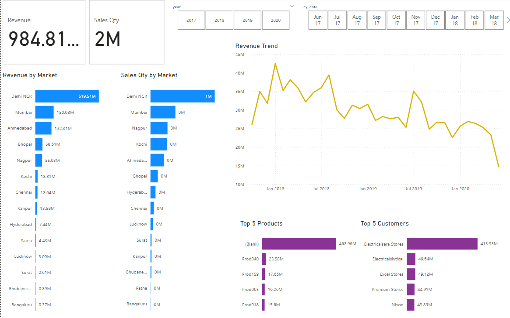

# Sales Report

## Problem Statement 
In this project I have created an interactive Power BI dashboard to unlock sales insights that are not visible before sales team for decision support and automate them to reduce manual time spent in data gathering.
This dashboard provides quick and latest sales insights in order to support data driven decision making.

### Data preview
This dataset consists of five schemas:
- Customers: It stores information related to customers like their name, type and this schema has a unique id 'customer_code' that is the primary key
- Transactions: It stores information related to all the transactions happening with the company's customers, like the id of the product sold, customer_code, sales_amount etc
- Products: It stores information related to the products sold by the company, product_code is it's primary key
- Markets: It stores information related to the market name and the zone in which their customers are located, markets_code is it's primary key
- Date: It stores information related to the dates on which the transactions happen
   

### Steps followed
1. Load data (.sql file) into MySQL Workbench, perform basic data analysis
2. Load the sql data file in PowerBI desktop
3. Performed data modelling, established relationships between the tables using the star schema approach
4. Performed data cleaning and ETL in Power Query Editor:
  - Removed rows having blank and non positive values in the 'Zone', 'Sales'columns
  - Removed duplicate records to maintain data quality
  - Added a column using conditional column in PowerBI, the new column would have sales quantity all represented in a single currency(Rs)
5. After completing ETL, built the dashboard using PowerBI dashboard:
  - Created new measures, Revenue and Sales Qty, displayed them using cards in PowerBi
  - Plotted a bar chart that shows distribution of revenue by markets
  - Plotted another bar chart that shows distribution of sales quantity by markets
  - Created multiple slicers that will avail the user to view all the data visuals by the year, month selected
  - Using a bar chart displayed the top 5 customers that generate the most revenue, using filters.
  - Also displayed the top 5 products that generate the most revenue
  - Plotted a revenue trend, revenue by month

    

